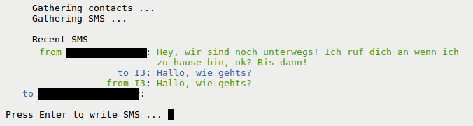
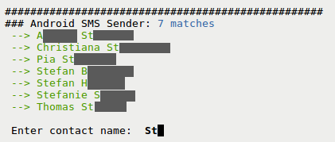
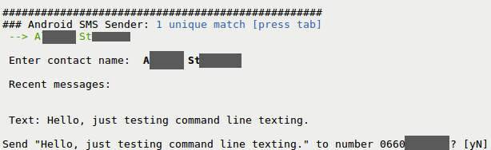

sendsms-scripts
===============

Perl scripts which facilitate sending SMS via an Android phone from the command line using [ShellMS] [1], querying the contacts and SMS databases of the phone.

 * Queries contact database to autocomplete names (press tab to auto-complete)
 * Queries SMS database to display recent conversations
 * Sends SMS using [ShellMS] [1] adb application

Tested on Linux on x86_64 and armv7h (Chromebook).

The only scripts of interest are write-sms.pl and get-sms.pl, both of which can be called without command line parameters.

Usage:

    perl write-sms.pl
    

    perl get-sms.pl

Requirements:
perl [Term::ReadKey,Term::Screen::Uni], ShellMS, adb

Changelog:

v0.1 (20130928): first release

License: GPLv2

[1]: https://github.com/try2codesecure/ShellMS
